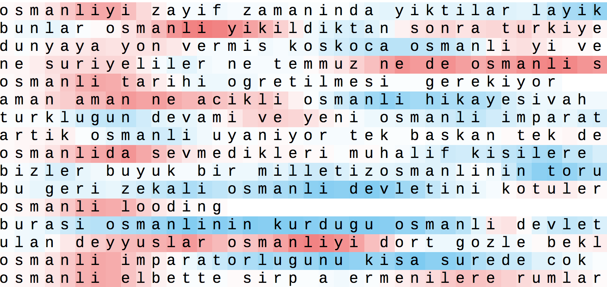
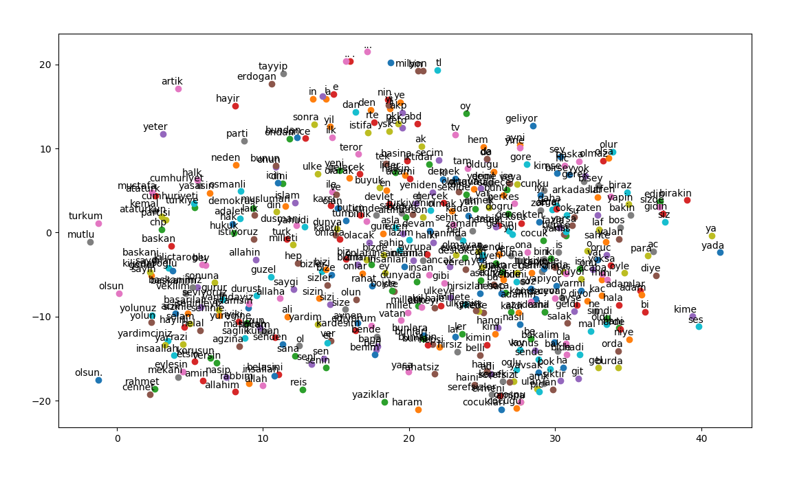

# Classification of User Comments into Social Media Groups with Opposing Views
The goal of this project is classifying user comments into social media groups with opposing views. In the scope
of this project, comments on Turkish and English pairs of Facebook pages are classified with Recurrent Neural Networks and Convolutional Neural Networks. This repository serves to provide code for study described in [report.pdf](report.pdf).

# Pre-requisites
- Python
- Keras
- Numpy
- Scikit Learn
- Django 
- Gensim
- Graphviz

# Usage
## LSTM
To train a char level LSTM on datasets in datasets directory:

    python classifier.py train <tr|en> 

To test the model and compare it with your prediction:

    python classifier.py test <tr|en> <trained_model> <trial_count>
    
To visualize cell activations for a given word:

    python classifier.py visualize <tr|en> <number_of_sentences> <word>

### Example Usages

    python classifier.py visualize tr ../trained_models/model-20171209-193942.h5 20 'ayakkabi'
    python classifier.py train tr
    python classifier.py test tr ../trained_models/model-20171209-193942.h5 10

## CNN with word embeddings
To train a CNN with word embeddings using comments as text files from the two groups with specified word vectors:

    python cnn_word_embbedings.py <first_dataset_path> <second_dataset_path> <word_vector_path> <word_vector_dimension> 

Maximum number of words in a comment default value is 300. To specify a different number use `--max_word_length`:

    python cnn_word_embbedings.py <first_dataset_path> <second_dataset_path> <word_vector_path> <word_vector_dimension> --max_word_length <max_sequence_length_in_words>

Maximum number of words from dataset to use default value is 30000. To specify a different number use `--max_nb_words`:

    python cnn_word_embbedings.py <first_dataset_path> <second_dataset_path> <word_vector_path> <word_vector_dimension> --max_nb_words

To plot accuracy and loss histories use `--plot`.

### Example Usage
    python cnn_word_embbedings.py ../datasets/trump-clinton/trump.txt ../datasets/trump-clinton/clinton.txt wiki.en.vec 300 --max_word_length 100 --max_nb_words 20000

## t-SNE visualization
To create word2vec model from corpus and visualize embeddings using t-SNE:

    python word2vec_tsne_plot.py <first_dataset_path> <second_dataset_path>

### Example Usage
    python word2vec_tsne_plot.py ../datasets/trump-clinton/trump.txt ../datasets/trump-clinton/clinton.txt

# Results on Turkish and English Datasets

| Dataset | Method | F1 Score | Precision | Recall |
|---|---|---|---|---|
| AKP/CHP | CNN | 0.7144 | 0.7953 | 0.6512 |
| AKP/CHP | LSTM | 0.7963 | 0.8160 | 0.7778 |
| Republican/Democrat | CNN | 0.7715 | 0.8052 | 0.7464 |
| Republican/Democrat | LSTM | 0.7599 | 0.7706 | 0.7498 |

### Accuracy
| Dataset | LSTM | GRU | CNN | Human |
|AKP/CHP | 82 | 80 | 75 | 75~ |
|Republican/Democrat | 76 | - | 78 | - |
Note: Human accuracy was calculated for a small subset of the data

